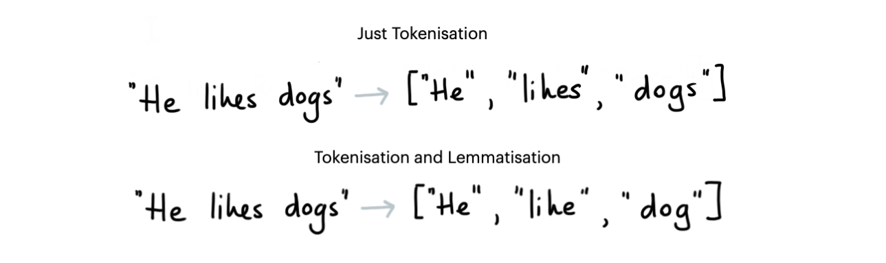
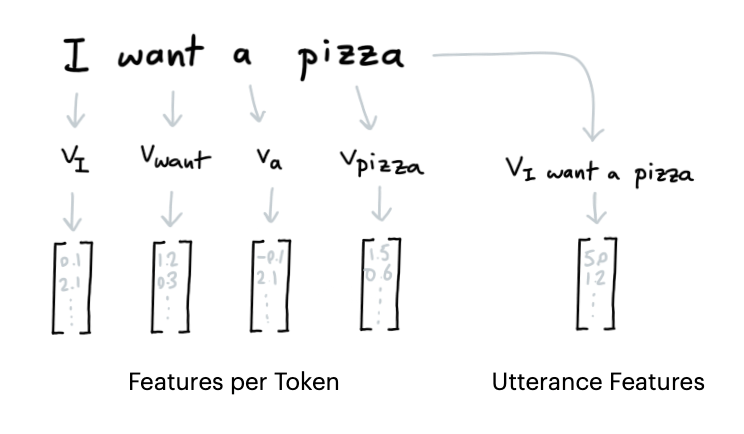

# Rasa NLU Examples


This repository contains Rasa compatible machine learning components. These components
are open sourced in order to encourage experimentation and to quickly offer support to
more tools. By hosting these components here they do not need to go through the same
vetting process as the components in Rasa and we hope that this makes it easier for
people to contribute new ideas.

The components in the repository are **not officially supported**. There will be units tests
as well as documentation but this project should be considered a community project,
not something that is part of core Rasa. If there's a component here that turns out to be
useful to the larger Rasa community then we might port features from this repository to Rasa.

# Install

To use these tools locally you need to install via git.

```python
python -m pip install "rasa_nlu_examples @ git+https://github.com/RasaHQ/rasa-nlu-examples.git"
```

Note that if you want to install optional dependencies as well that you'll need to run:

```python
python -m pip install "rasa_nlu_examples[flashtext] @ git+https://github.com/RasaHQ/rasa-nlu-examples.git"
python -m pip install "rasa_nlu_examples[dateparser] @ git+https://github.com/RasaHQ/rasa-nlu-examples.git"
python -m pip install "rasa_nlu_examples[thai] @ git+https://github.com/RasaHQ/rasa-nlu-examples.git"
python -m pip install "rasa_nlu_examples[fasttext] @ git+https://github.com/RasaHQ/rasa-nlu-examples.git"
python -m pip install "rasa_nlu_examples[all] @ git+https://github.com/RasaHQ/rasa-nlu-examples.git"
```

If you're using any models that depend on spaCy you'll need to install the Rasa dependencies
for spaCy first.

```python
python -m pip install rasa[spacy]
```

# Documentation

You can find the documentation for this project [here](https://rasahq.github.io/rasa-nlu-examples/).

# Compatibility

This project currently supports components for Rasa 3.0. For older versions, see the list below.

- [version 0.1.3](https://github.com/RasaHQ/rasa-nlu-examples/tree/0.1.3) is the final release for Rasa 1.10
- [version 0.2.8](https://github.com/RasaHQ/rasa-nlu-examples/tree/0.2.8) is the final release for Rasa 2.8

## **Tokenizers**



Tokenizers can split up the input text into tokens. Depending on the Tokenizer that you pick
you can also choose to apply lemmatization. For languages that have rich grammatical features
this might help reduce the size of all the possible tokens.

- **`rasa_nlu_examples.tokenizers.BlankSpacyTokenizer` [docs](https://rasahq.github.io/rasa-nlu-examples/docs/tokenizer/spacy_tokenizer/)**
- **`rasa_nlu_examples.tokenizers.ThaiTokenizer` [docs](https://rasahq.github.io/rasa-nlu-examples/docs/tokenizer/thai_tokenizer/)**

## **Featurizers**



Dense featurizers attach dense numeric features per token as well as to the entire utterance. These
features are picked up by intent classifiers and entity detectors later in the pipeline.

- **`rasa_nlu_examples.featurizers.dense.FastTextFeaturizer` [docs](https://rasahq.github.io/rasa-nlu-examples/docs/featurizer/fasttext/)**
- **`rasa_nlu_examples.featurizers.dense.BytePairFeaturizer` [docs](https://rasahq.github.io/rasa-nlu-examples/docs/featurizer/bytepair/)**
- **`rasa_nlu_examples.featurizers.dense.GensimFeaturizer` [docs](https://rasahq.github.io/rasa-nlu-examples/docs/featurizer/gensim/)**
- **`rasa_nlu_examples.featurizers.sparse.TfIdfFeaturizer` [docs](https://rasahq.github.io/rasa-nlu-examples/docs/featurizer/tfidf/)**
- **`rasa_nlu_examples.featurizers.sparse.HashingFeaturizer` [docs](https://rasahq.github.io/rasa-nlu-examples/docs/featurizer/hashing/)**

## **Intent Classifiers**


Intent classifiers are models that predict an intent from a given user message
text.  The default intent classifier in Rasa NLU is the [DIET
model](https://rasa.com/docs/rasa/components#dietclassifier-2) which can be
fairly computationally expensive, especially if you do not need to detect
entities. We provide some examples of alternative intent classifiers here.

- **`rasa_nlu_examples.classifiers.NaiveBayesClassifier` [docs](https://rasahq.github.io/rasa-nlu-examples/docs/extractors/naive-bayes/)**
- **`rasa_nlu_examples.classifiers.LogisticRegressionClassifier` [docs](https://rasahq.github.io/rasa-nlu-examples/docs/extractors/logistic-regression/)**

## **Entity Extractors**


- **`rasa_nlu_examples.extractor.FlashTextEntityExtractor`** [docs](https://rasahq.github.io/rasa-nlu-examples/docs/extractors/flashtext/)
- **`rasa_nlu_examples.extractor.DateparserEntityExtractor`** [docs](https://rasahq.github.io/rasa-nlu-examples/docs/extractors/dateparser/)

## **Name Lists**

Language models are typically trained on Western datasets. That means
that the reported benchmarks might not apply to your use-case. For example; detecting
names in texts from France is not the same thing as detecting names in Madagascar. Even
though French is used actively in both countries, the names of it's citizens might
be so different that you cannot assume that the benchmarks apply universally.

To remedy this we've started collecting name lists. These can be used as a lookup table
which can be picked up by Rasa's [RegexEntityExtractor](https://rasa.com/docs/rasa/components#regexentityextractor)
or our [FlashTextEntityExtractor](https://rasahq.github.io/rasa-nlu-examples/docs/extractors/flashtext/).
It won't be 100% perfect but it should give a reasonable starting point.

You can find the namelists [here](https://github.com/RasaHQ/rasa-nlu-examples/tree/master/data/namelists).
We currently offer namelists for the United States, Germany as well as common Arabic names.
Feel free to submit PRs for more languages. We're also eager to receive feedback.

# Usage

You can install the examples from this repo via pip. Let's say you download the standard tools.

```
pip install git+https://github.com/RasaHQ/rasa-nlu-examples
```

Once installed you can add tools to your `config.yml` file, here's an example;

```yaml
language: en
pipeline:
- name: WhitespaceTokenizer
- name: CountVectorsFeaturizer
  OOV_token: oov.txt
  analyzer: word
- name: CountVectorsFeaturizer
  analyzer: char_wb
  min_ngram: 1
  max_ngram: 4
- name: rasa_nlu_examples.featurizers.dense.BytePairFeaturizer
  lang: en
  vs: 1000
  dim: 25
- name: DIETClassifier
  epochs: 200
```

An example config for using the Thai tokenizer would look like:

```yaml
language: th
pipeline:
  - name: rasa_nlu_examples.tokenizers.ThaiTokenizer
  - name: CountVectorsFeaturizer
  - name: CountVectorsFeaturizer
    analyzer: char_wb
    min_ngram: 1
    max_ngram: 4
  - name: DIETClassifier
    epochs: 200
```

And you can use this file to run benchmarks. From the root folder of the project typically
that means running something like;

```
rasa test nlu --config basic-bytepair-config.yml \
          --cross-validation --runs 1 --folds 2 \
          --out gridresults/basic-bytepair-config
```

# Open an Issue

If you've spotted a bug then you can submit an issue [here](https://github.com/RasaHQ/rasa-nlu-examples/issues).
GitHub issues allow us to keep track of a conversation about this repository and it is the preferred
communication channel for bugs related to this project.

# Contribute

There are many ways you can contribute to this project.

- You can suggest new features.
- You can let us know if there are bugs.
- You can share the results of an experiment you ran using these tools.
- You can let us know if the components in this library help you.

Feel free to start the discussion by opening an issue on this repository. Before submitting code
to the repository it would help if you first create an issue so that the maintainers can disucss
the changes you would like to contribute. A more in-depth contribution guide can be found
[here](https://rasahq.github.io/rasa-nlu-examples/contributing/).

To get started locally you can run:

```
python -m pip install -e ".[dev]"
pre-commit install
python tests/scripts/prepare_fasttext.py
```

Alternatively you may also run this via the `Makefile`:

```
make install
```

## Documentation 

If you want to build the documentation locally you can do so via; 

```
mkdocs serve
```

If you want to deplot the docs to GitHub you can run; 

```
mkdocs gh-deploy
```

This will deploy a new version to the `docs` branch, which is picked up by GitHub pages. 
